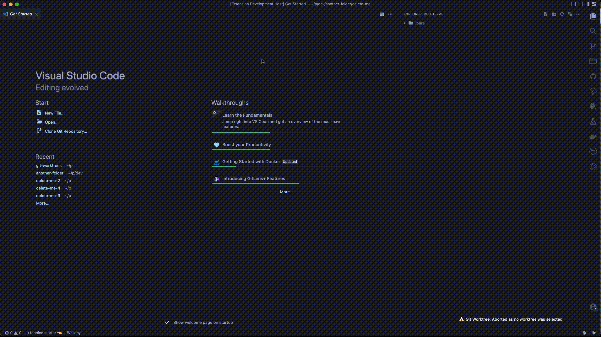
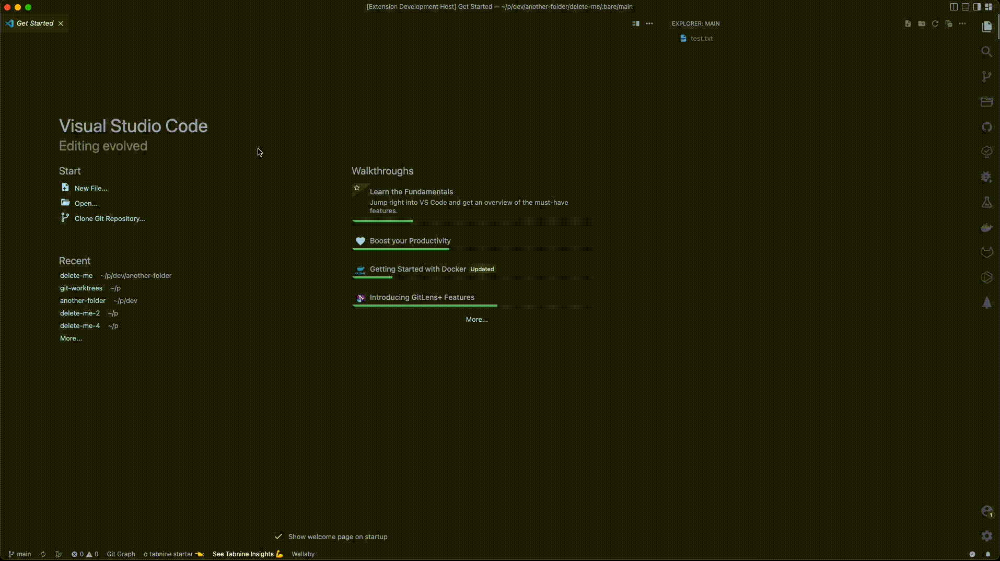
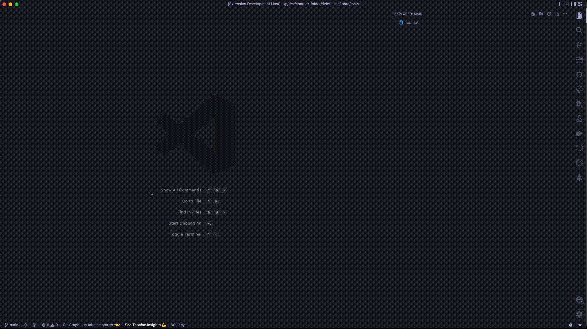
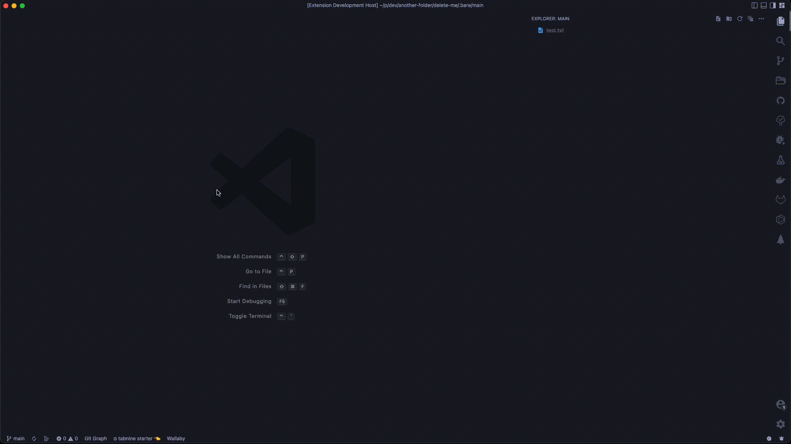
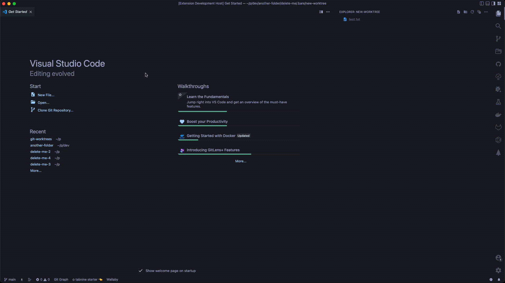
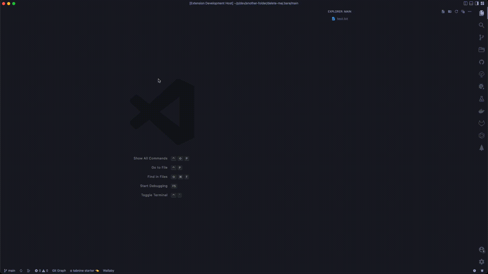

# Git Worktree

I made this extension because I started using git worktrees and I wanted to
make it easier to manage and setup

Hopefully it helps and enjoy 👋

## Features

These are a list of features that I have currently implemented

#### Clone Command

#### Add Command

#### List Command

#### Rename Command

#### Remove Command

#### Publish Command

#### Projects Command

## Requirements

- git

## Extension Settings

This extension has the following settings:

- `myExtension.enable`: Enable/disable this extension.
- `myExtension.thing`: Set to `blah` to do something.

## Release Notes

### 1.0.0

Initial release
